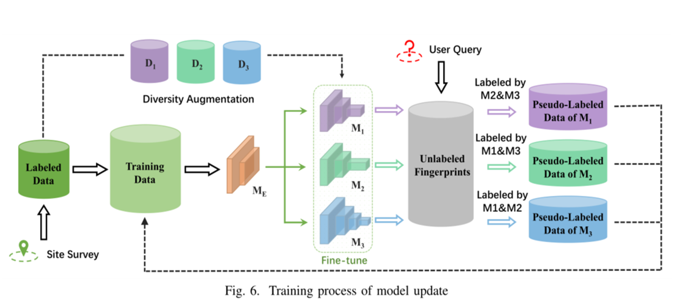
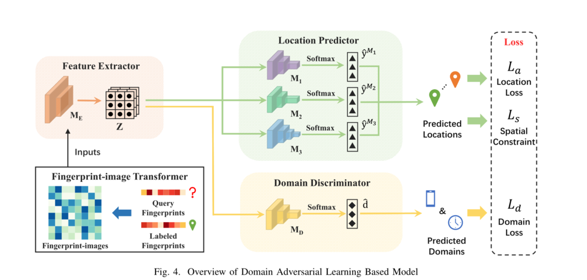
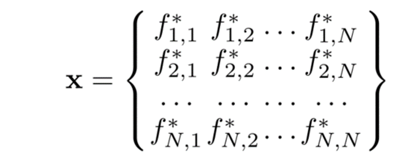
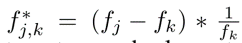
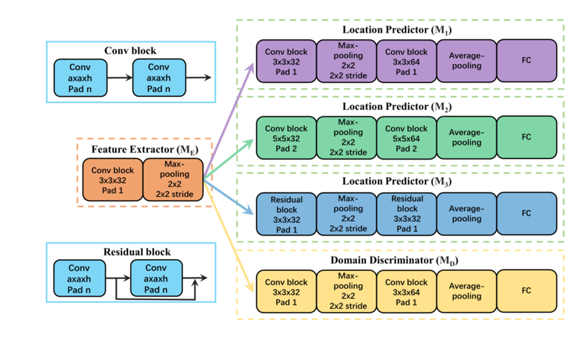

# iToLoc

> 该项目试图复现INFOCOM 21论文《Train Once, Locate Anytime for Anyone: Adversarial Learning based Wireless Localization》提出的iToLoc方法。该方法也是基于DANN的领域对抗神经网络。

## 一、数据集

[UCI 机器学习存储库：UJIIndoorLoc 数据集][data]

## 二、整体架构

## 三、DANN

### 0.整体架构

### 1.输入

其中，f为wifi指纹向量

### 3.网络结构

### 4.输出

933维特征向量，代表933个不同位置的预测概率。

## 三、协同训练

详情见项目代码，参考文献《Tri-net for semi-supervised deep learning》

可参考[Tri-net][tri-net]代码（可恶，当初怎么没找到现成的tri-net代码）

## 四、实验结果

效果不佳，尝试过以下措施：

1.输入不变，使用moblienet_v2进行分类查看效果；

2.使用MNIST数据集测试Tri-net算法（纯手搓）;

3.详见代码。

注意：UJIndoorLoc数据集本身的精度就不高，根据《EdgeLoc: A Robust and Real-Time Localization System Toward Heterogeneous IoT Devices》中给出的表格，定位平均回归精度在8m左右，那么换成分类也就20%的正确率，所以实际上本项目的复现并非失败。

[tri-net]:http://www.lamda.nju.edu.cn/(X(1)S(52gpbgjulpwn3fhrwff1dvvb))/Default.aspx?Page=code_Tri-net&NS=&AspxAutoDetectCookieSupport=1
[data]:http://archive.ics.uci.edu/ml/datasets/UJIIndoorLoc

